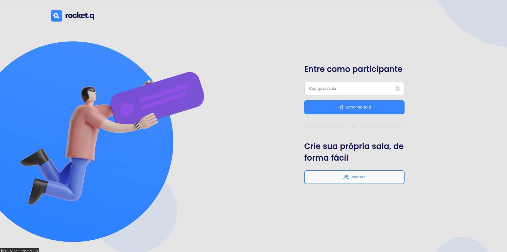
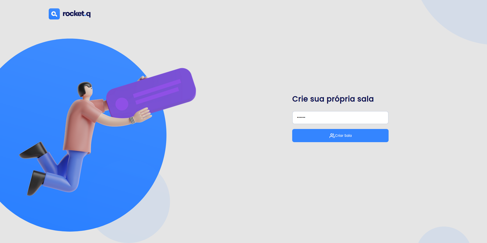
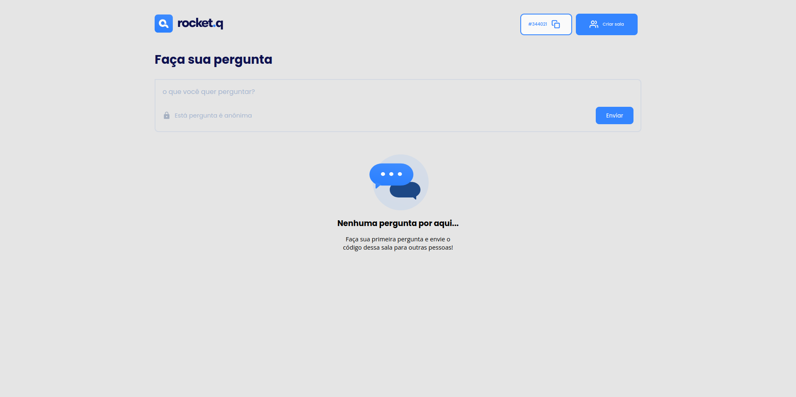
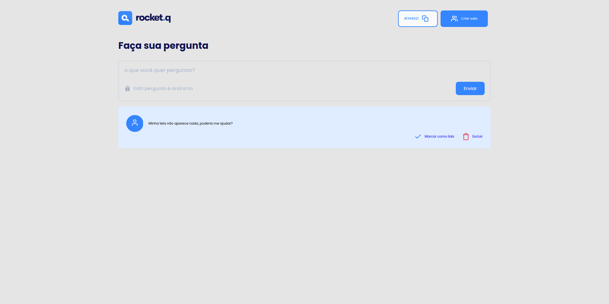
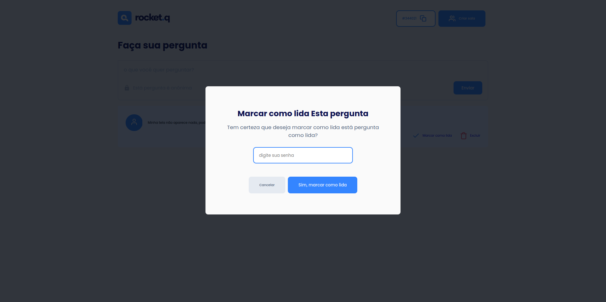
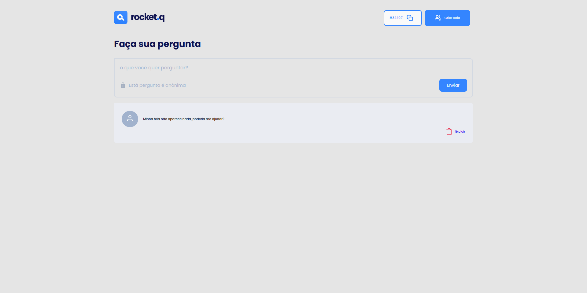
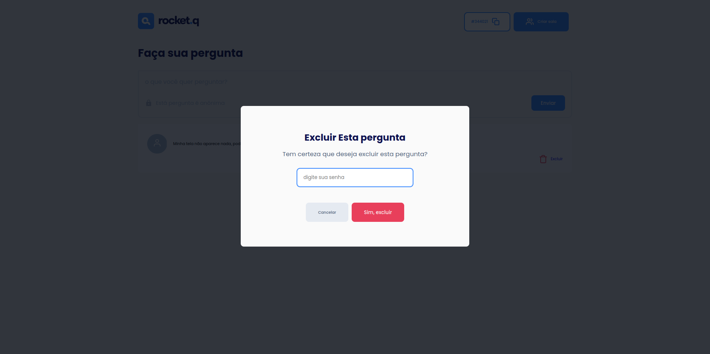
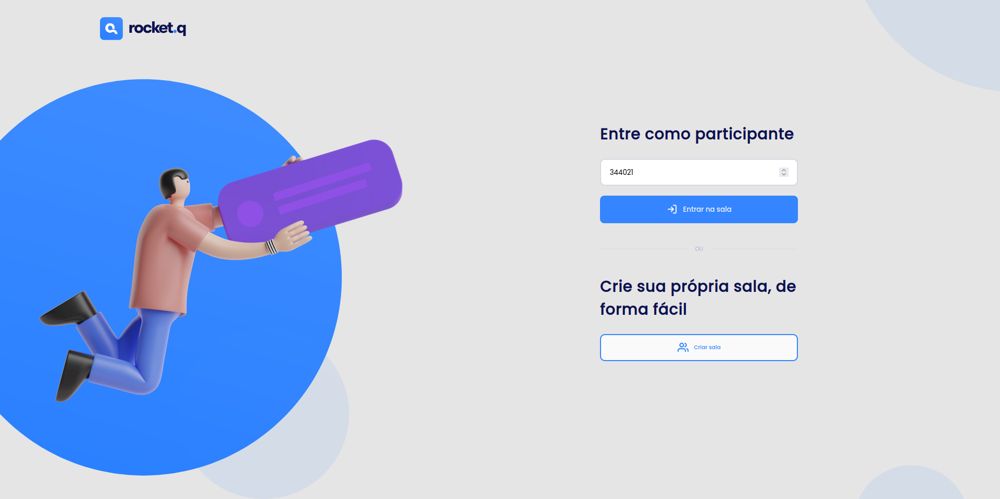

# Rocket.q — Documentação de Acesso Local

Esta documentação apresenta o fluxo básico para executar e acessar o sistema localmente pelo navegador, além de registrar as principais telas da aplicação.

## Requisitos

Antes de iniciar, verifique se você possui instalado em sua máquina:

- Node.js
- npm
- Navegador web atualizado

## Como executar o sistema localmente

No terminal, dentro da pasta do projeto, execute os comandos abaixo:

```bash
npm install
npm start
```

Após a inicialização, abra o navegador e acesse:

```text
http://localhost:3000
```

> Observação: pela interface exibida nas imagens, o sistema está configurado para rodar localmente na porta `3000`.

---

## Fluxo de uso do sistema

### 1. Tela inicial

A tela inicial permite que o usuário entre como participante usando um código de sala ou crie uma nova sala.



---

### 2. Criação de sala

Ao informar uma senha e confirmar, o sistema cria uma nova sala para recebimento de perguntas.



---

### 3. Sala criada sem perguntas

Após criar a sala, o sistema exibe o código da sala no topo e a área para envio de perguntas. Quando ainda não houver nenhuma pergunta cadastrada, é apresentada a mensagem de estado vazio.



---

### 4. Lista com pergunta cadastrada

Quando uma pergunta é enviada, ela passa a ser exibida em lista, com ações disponíveis para marcação como lida ou exclusão.



---

### 5. Ações da pergunta

Cada pergunta possui ações disponíveis na lateral direita da linha:

- Marcar como lida
- Excluir


---

### 6. Modal para marcar como lida

Ao selecionar a opção de marcar como lida, o sistema abre um modal de confirmação solicitando a senha da sala.



---

### 7. Pergunta marcada como lida

Depois da confirmação, a pergunta permanece listada sem a ação de marcação, indicando que já foi tratada.



---

### 8. Modal para exclusão da pergunta

Ao selecionar a opção de exclusão, o sistema solicita novamente a senha da sala antes de remover o item.



---

### 9. Sala sem perguntas após exclusão

Após excluir a pergunta, a tela volta ao estado vazio da sala.


---

### 10. Entrada em sala existente por código

Na tela inicial, também é possível acessar uma sala já criada informando o código da sala no campo correspondente.



---

## Resumo rápido para acesso

```bash
npm install
npm start
```

Depois, no navegador:

```text
http://localhost:3000
```

## Estrutura desta documentação

```text
SITE-PERGUNTAS-ANONIMAS/
├── README.md
└── image-documentation/
    ├── home-entrada.png
    ├── criar-sala.png
    ├── sala-vazia.png
    ├── lista-perguntas.png
    ├── acoes-pergunta.png
    ├── modal-marcar-lida.png
    ├── pergunta-lida.png
    ├── modal-excluir.png
    ├── sala-sem-perguntas.png
    └── entrar-sala-codigo.png
```
